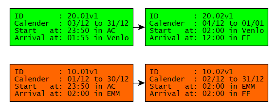
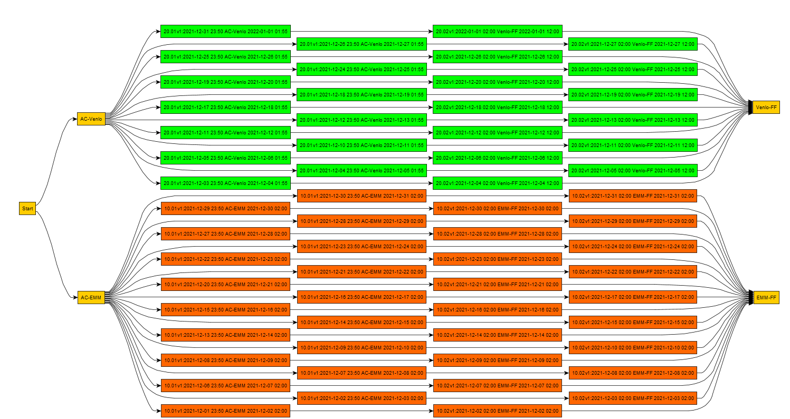
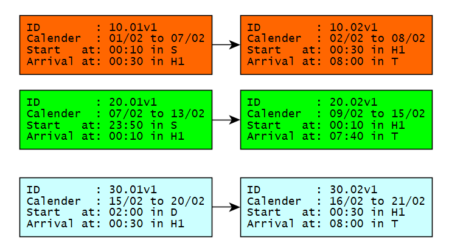
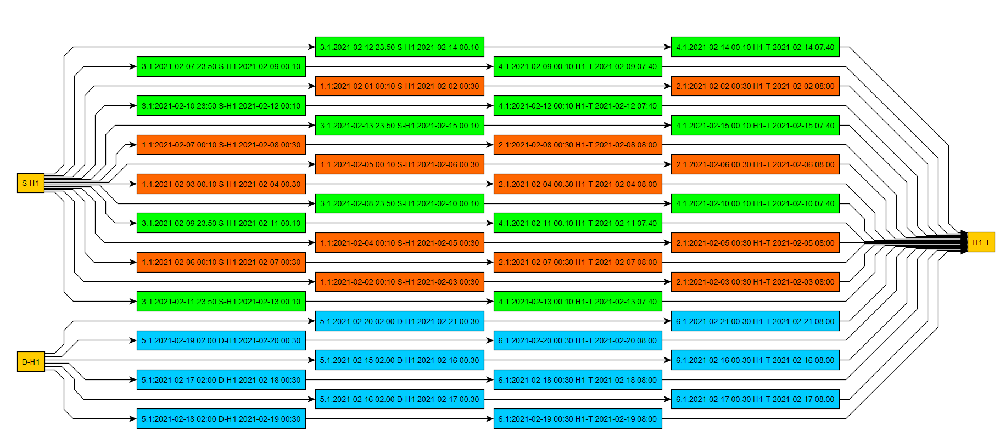
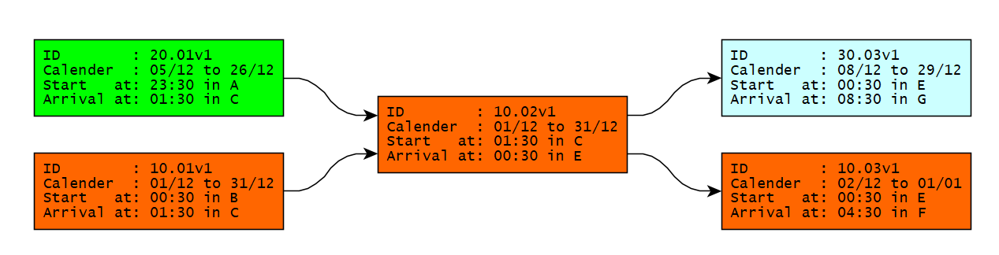
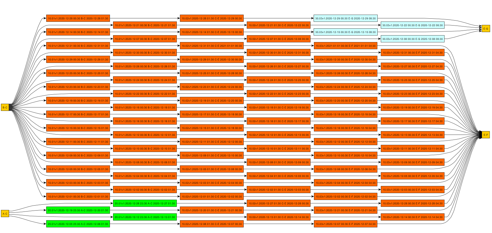

.. toctree::
   :maxdepth: 4

.. include:: references.rst
.. _routedomainmodel:

==================
Route Domain Model
==================

.. _Sector Handbook: http://taf-jsg.info/wp-content/uploads/2019/10/190604_js_handbook_2.0_with_xsd_2.2.3_0.pdf
.. _JSG: http://taf-jsg.info/

--------
Overview
--------

Each international train has to be split into sections when the train crosses a border.  The split
locations are called handover points. At each handover the responsibility for the train planning
changes from IM to IM and RU to RU. The planning process is coordinated by the `RoutingInfo
.lead_ru`.

This `UML class diagram`_ [#f1]_ shows the main concepts involved:

.. uml:: uml/tom-01-overview.puml
   :caption: Overview Routing Model

An international :class:`~tom.tom.Train` [#f2]_ must at least have two sections. All
`RouteSections` of a train are bundled in a `RoutingInfo`. The *Lead RU* is responsible for
the correctness and communication of this information to all involved companies. The
following constraint must hold for each :class:`~tom.tom.RouteSection`:

.. admonition:: Rule SEC-JL Journey Locations

   - `RouteSection.departure_station` is a *Origin* or *Handover*
   - `RouteSection.arrival_station` is a *Handover* or *Destination*

For each `RouteSection` the `planning_im` and `applicant_ru` exchange *PathRequest* and
*PathDetails* to plan the detailed route within a `RouteSection`. This process is described in
detail in the `Sector Handbook`_ of the RU/IM Telematrics JSG_.  As long as borders of a section
both in location and time are unchanged no other participant in the planning of the whole train has
to be informed. See also `Routing Planning Process <routing-planning-process.html#routing-process>`_.

The following paragraph describes the minimal information which all companies involved must know
about the `RoutingInfo`. Changes to this information have to be propagated by the lead RU.

-----------------------------------
Train, RoutingInfo and RouteSection
-----------------------------------

The following diagramm shows the three main classes of our proposition for the Route Domain Model. It
describes the minimum information needed for a valid route information of an international train:

.. uml:: uml/tom-02-section.puml
   :caption: RoutingInfo and RouteSection

A train has zero or one `RoutingInfo` which bundles the information in `RouteSections`. The version
is incremented each time one or more RouteSections have changed.

Timestamps
~~~~~~~~~~

This model completely describes a planned set of *train runs*. Each train run is a sequence of
*section runs* which have to connect properly in time at handover points. The timing attributes of
a `RouteSection` serve this purpose:

- `calendar` is a set of calendar days where the train starts at `RouteSection.departure_station`
- `departure_time` is the day time the train starts each day in `calendar`
- `departure_stop_time` planned stop time at a section handover station of departure
- `travel_time` travel time from section station of departure to section station
  of arrival. This attribute is used to calculate the arrival time at station of arrival.

Only RouteSections have a calendar.  This is the set of starting days at the departure_station of a section.
All timestamps in Train, TrainRun and SectionRuns (see next chapter) are calculated from these timing
attributes.

.. admonition:: Rule SEC-CAL RouteSection Calendar must be subset of timetable year

   The `RouteSection.calendar` must be a subset of the timetable year of its train.

Because a train can have several starting RouteSections (i.e. different departure stations and
dates) it makes no sense to assign a calender to a train. A calender must always be relativ to a fixed
start location. `example-ac-ff`_ explains such a situation with an overnight train in the
starting sections.

Working with only timestamps also avoids the difficulties with overnight trains. No OTR (*Offset To
Reference*) is needed!

Calendars
~~~~~~~~~

In our model these classes have a calendar:

* A RouteSection defines the planned daily runs of a train
* A PathRequest is planned for a RouteSection
* A Path is created in response to a PathRequest of an RU to an IM

.. uml:: uml/tom-02-calendars.puml
   :caption: Calendars of RouteSection, PathRequest and Path

The following rules must hold for a consistent set of paths of a train:

.. admonition:: Rule SEC-CAL Section-PathRequest-Path calendar relationships

   * The calendar of a PathRequest must be a subset of the calendar of the section it is planned for.
   * The calendar of a Path must be a subset of the calendar the PathRequest it is a response.
   * The calendars of two different PathRequests of a RouteSection must be pairwise disjoint.
   * The calendars of two different Paths of a PathRequest must be pairwise disjoint.
   * The calender of a RouteSection must be the union of the calendars of its PathRequests.
   * The calender of a PathRequest must be the union of the calendars of its Paths.

The last two rules must hold when the path allocation process is finished. The other must always
hold. Objects that violate these conditions must not be communicated among partners. Such messages
have to be answered with an `ErrorMessage`.

Identifiers
~~~~~~~~~~~

The method Train :meth:`~tom.tom.Train.train_id` computes the unique trainID from `core_id`, `lead_ru` and
`timetable_year`.

.. admonition:: Rule SEC-UID Unique Section ID

   :meth:`RouteSection.section_id <tom.tom.RouteSection.section_id>` must be unique within the set
   of sections of a train.

The `section_id` is used to make the daily train IDs unique in case of overnight trains. Using the
start date of a train results in duplicate train IDs. See example below.

.. admonition:: Rule SEC-UFK Unique functional key of sections

   A route section of a train is uniquely identified by this quadruple:

   `((section.departure_station, section.departure_time), (section.arrival_station, section.arrival_time))`

Therefore, if on some day in the calendar of a section the train from section station of departure
`AC` to section station of arrival `EMM`
should arrive at at different time at `EMM`, the RU has to define a new RouteSection for
this day. If `EMM` is a handover, the lead RU must ask the applicant RU of the following section to
create fitting route section with section station of departure `EMM`.

Versioning
~~~~~~~~~~

We suggest *versioning* of trains and sections to support the synchronsisation of the domain model
between the systems of the cooperating companies. If the lead RU changes a section its
`RouteSection.version` is incremented. Same with the `RoutingInfo.version`. The receiver of a message
containing the RoutingInfo [#f3]_ can use this information to identify the change and act
accordingly.

-----------------------
TrainRun and SectionRun
-----------------------

In this section we describe, how the daily train (i.e. a `TrainRun`) and section runs are computed
from the routing info of a `Train` described in the previous section.

- A :class:`~tom.tom.SectionRun` is derived for each day in the calendar of its `RouteSection`
- A :class:`~tom.tom.TrainRun` is computed from SectionRuns that *fit* together. Two sections `s, t`
  fit together if `s.connects_to(t) == True` (see :meth:`~tom.tom.SectionRun.connects_to`).

.. uml:: uml/tom-03-section-run.puml

SectionRun
~~~~~~~~~~

For each day in day in `RouteSection.calendar` a section run is created. All `SectionRuns` of a
section differ only in the value of :meth:`~tom.tom.SectionRun.departure_time`, which is the only
information stored in a SectionRun. All other values shown can be computed from this timestamp and
the attributes of the section the run belongs to.

TrainRun
~~~~~~~~

Whereas the section runs can easily computed from information in its RouteSection (mainly calendar
and departure time at section station of departure), the train runs must be computed from all
possible SectionRun sequences that fit together.

We use a graph algorithm to compute all train runs. The graph used is best described by the examples
shown below. The central methods are:

* :meth:`~tom.tom.Train.train_run_graph` which computes a directed Graph G = (SectionRun, E), where
  (s,t) in E <=> s.connects_to(t).
* :meth:`~tom.tom.Train.extended_train_run_graph` which adds to synthetic vertices to G, one at the
  beginning (`START`) connecting to departure stations of SectionRuns and one at the end (`END`)
  which connects to all stations of arrival of SectionRuns.
* :meth:`~tom.tom.Train.train_run_iterator` which computes all TrainRuns out of all path in G from
  `START` to `END`.

.. _example-ac-ff:

------------------------------------------
Example: Train from Amsterdam to Frankfurt
------------------------------------------

Given this infrastructure:

.. uml:: uml/tom-04-example-ac-ff-infrastructure.puml

This object diagramm shows a szenario for a train from AC to Frankfurt FF which is planned to
operate in december 2021. On Fri-Sun handover is EMM. On Mon-Thu handover is Venlo.

.. uml:: uml/tom-04-example-ac-ff.puml

Specification with YAML
~~~~~~~~~~~~~~~~~~~~~~~

The following YAML-file is a machine readable specification of the route sections of a train with
CoreID `12AB`:

.. literalinclude:: ../tests/data/train-ac-ff.yml
   :language: yaml

Section Graph
~~~~~~~~~~~~~

The following picture shows the involved sections in compact notation. Notice the shift of calendars
of the sections with ID 10.02 and 20.02 because they run over midnight.

   Section Graph Example Amsterdam to Frankfurt

TrainRun Graph
~~~~~~~~~~~~~~

The resulting *TrainRun-Graph* can be calculated with
:meth:`~tom.tom.Train.extended_train_run_graph` and looks like this:

   TrainRun Graph Example Amsterdam to Frankfurt

You can download this graph as GraphML_ here: :download:`examples/train-TR-12AB-1.graphml`.

Timetable
~~~~~~~~~

.. _Pandas DataFrame: https://pandas.pydata.org/pandas-docs/stable/reference/api/pandas.DataFrame.html

With :meth:`~tom.tom.Train.to_dataframe` you can create a `Pandas DataFrame`_ which you can export
to excel or csv representing the time table of the train. See :download:`examples/train-TR-12AB-1.xlsx`.

This is the timetable of version 1 of TR-12ABv1:

.. csv-table:: Timetable TR-12ABv1
   :file: ../tests/train-TR-12AB-1.csv
   :header-rows: 1

.. _example-annex-4-1:

----------------------
Example: Train Annex 4
----------------------

Given this infrastructure:

.. uml:: uml/tom-06-example-annex-4-infrastructure.puml

Specification with YAML
~~~~~~~~~~~~~~~~~~~~~~~

The following routing specification describes the initial planned routes for Train with `ID1`. As
you can see, there is no route section needed which mentions Station `M`. This station does not play
a role in the routing planning process because it is no origin, destination or handover.

.. literalinclude:: ../tests/data/train-annex-4.yml
   :language: yaml

Section Graph
~~~~~~~~~~~~~

The following graph shows the involved sections in compact notation. Notice the shift of calendars
of the sections with ID 10.02 and 20.02 because they run over midnight.

   Section Graph Example Annex 4

We see 6 sections which define three routes, two starting from `S` and one from `D`.

TrainRun Graph
~~~~~~~~~~~~~~

The resulting train run graph looks like this:

   TrainRun graph of example Annex 4 initial planning status.

Vertices (`SectionRuns`) with same color belong to the same `RouteSection`. The vertice label
shows Section IDs and there versions (ID.version).

You can download this graph as GraphML_ here: :download:`examples/train-TR-ID1-1.graphml`.

Timetable
~~~~~~~~~

This is the timetable of version 1 of TR-ID1. Notice the two train runs with ID
`TR/8350/ID1/2021/10.01/2021-02-07` and `TR/8350/ID1/2021/20.01/2021-02-07`. They both start on
`07/02`. To make the ID unique on this operating day, we propose to add the `section_id` to be part
of `TrainRun.train_id()`. Here `10.01` for the train starting at `00:10` and `20.01` for the train
departing at `23:50` at station `S`.

.. csv-table:: Timetable TRID1v01
   :file: ../tests/train-TR-ID1-1.csv
   :header-rows: 1

Download the timetable as Excel here: :download:`examples/train-TR-ID1-1.xlsx`.

.. _example-a-f:

-----------------------------
Example: Train with three IMs
-----------------------------

Given this infrastructure:

.. uml:: uml/tom-05-example-a-f-infrastructure.puml

This object diagramm shows a szenario for a train from A,B to F,G which is planned to operate in
december 2020.

.. uml:: uml/tom-05-example-a-f.puml

Specification with YAML
~~~~~~~~~~~~~~~~~~~~~~~

.. literalinclude:: ../tests/data/train-a-f.yml
   :language: yaml

Section Graph
~~~~~~~~~~~~~

   Sections of example with 3 IMs. This example shows a situation, where the middle section ist used
   by both starting and ending sections.

TrainRun Graph
~~~~~~~~~~~~~~

You can see 4 train runs starting from A, 31-4 starting from B, 4 arriving in G and 31-4 arriving
in F.

You can download this graph as GraphML_ here: :download:`examples/train-TR-13AB-1.graphml`.

Timetable as Excel-Sheet
~~~~~~~~~~~~~~~~~~~~~~~~

Download the time table for `Train-13AB` here: :download:`examples/train-TR-13AB-1.xlsx`.

.. rubric:: Footnotes

.. [#f1] We use PlantUML_ as modeling tool. See explanations there.
.. [#f2] Click on the link to see the python source code for the code element
.. [#f3] Train and RouteSections could be transported in the TAF/TAP `TrainInformation` message
         structure.
