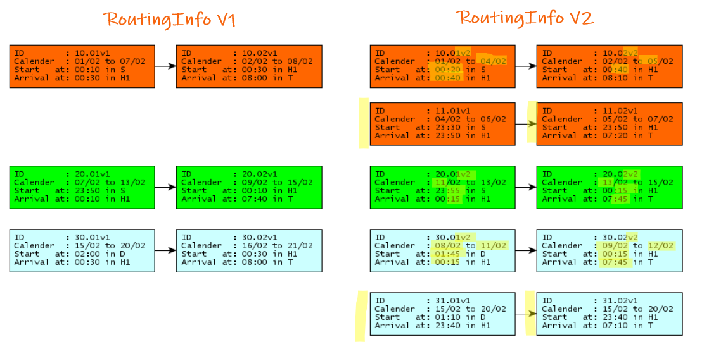

.. toctree::
   :maxdepth: 4

.. include:: references.rst

.. _routing-process:

========================
Routing Planning Process
========================

--------
Overview
--------

The routing planning process starts with a first version of a `RoutingInfo` of a train. For each
version and each section the `Path Planning Process` between `ApplicantRU` and `ResponseIM` of the
section is carried out until the section is completely *covered* with allocated paths. We use an
`UML sequence diagram`_ to describe the message flow:

.. uml:: uml/rp-05-basic-msg-exchange-pattern.puml
   :caption: Basis message exchange pattern between involved parties

If in between the participants find out, that a planned version of a RoutingInfo cannot be
constructed, a new version is created and communicated by the `LeadRU` to the `ApplicantRUs`
(Harmonisation). These in turn inform their `ResponseIMs` with each `PathRequest` containing also
the new version of the `RoutingInfo`.

The `Path Planning Process` for each defined section has then to start over again. This must only be
done for sections with a new version or totally new sections.

.. _example-annex-4-2:

----------------------------------------
Example: Route Planning of Train Annex 4
----------------------------------------

.. _Example Train Annex 4: auto_examples/plot_annex_4.html#bildfahrplan

The initial planned routing of Train `ID1` is shown in `Example Train Annex 4`_.

Planning Process for version 1
~~~~~~~~~~~~~~~~~~~~~~~~~~~~~~

The following messages have to be exchanged by the involved companies to begin the planning process
for this train.

.. uml:: uml/rp-10-initial-setup.puml
   :caption: Initial message flow to build path consistent with routing info

For various reasons this process could not be finished. A second RoutingInfo version RI-v2 for the
train must now be communicated by the lead RU, which is specified in the next chapter.

RoutingInfo of example Annex 4 v2
~~~~~~~~~~~~~~~~~~~~~~~~~~~~~~~~~

.. _Example Train Annex 4 Version 2: auto_examples/plot_annex_4_v2.html#bildfahrplan
.. _section graph version 2: auto_examples/plot_annex_4_v2.html##section-graph

The updated routing info specification describes the planned final status. You can download it here:
:download:`../tests/data/train-annex-4-2.yml`.
See `Example Train Annex 4 Version 2`_ for details.

Look at the resulting new section graph to see the differences (marked in yellow):

   Section graph Annex 4 version 2

Planning Process for version 2
~~~~~~~~~~~~~~~~~~~~~~~~~~~~~~

The following messages have to be exchanged by the involved companies to reach the state defined by
version 2 of the routing info:

.. uml:: uml/rp-20-route-update.puml
   :caption: Message flow to build path consistent with routing info version 2
